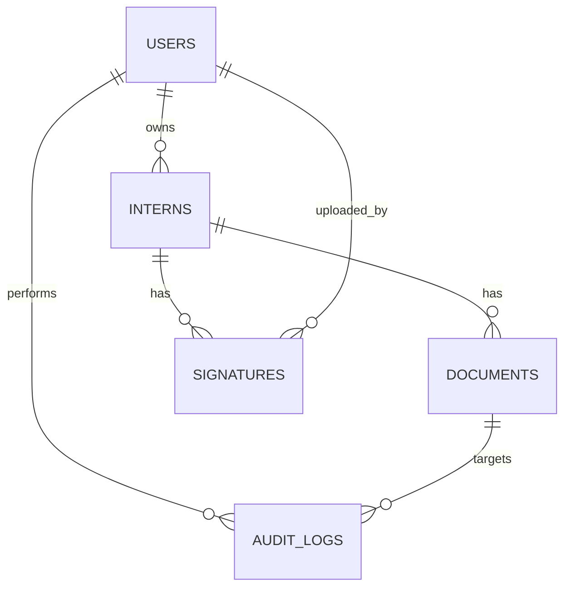

# Database Design & CRUD Specification

This document defines the relational data model, DDL, indexes, constraints, API contracts for CRUD operations, example SQL queries, and implementation notes for transactionality and backups.

**Scope:** interns, documents, users, signatures, audit logs, roles.

---

## ER Diagram (text)

Mermaid ER diagram:



---

## Tables & DDL (PostgreSQL)

Note: use `uuid_generate_v4()` extension for UUID primary keys.

```sql
-- Enable uuid extension
CREATE EXTENSION IF NOT EXISTS "uuid-ossp";

-- users (map Firebase UID or local auth)
CREATE TABLE users (
  id uuid PRIMARY KEY DEFAULT uuid_generate_v4(),
  uid text UNIQUE NOT NULL, -- firebase uid
  email text UNIQUE,
  name text,
  role text NOT NULL DEFAULT 'recruiter',
  created_at timestamptz NOT NULL DEFAULT now()
);

-- interns
CREATE TABLE interns (
  id uuid PRIMARY KEY DEFAULT uuid_generate_v4(),
  full_name text NOT NULL,
  name_with_initials text,
  nic text NOT NULL,
  address text NOT NULL,
  department text,
  start_date date,
  end_date date,
  supervisor_name text,
  supervisor_title text,
  phone text,
  metadata jsonb DEFAULT '{}'::jsonb,
  created_by uuid REFERENCES users(id) ON DELETE SET NULL,
  created_at timestamptz NOT NULL DEFAULT now(),
  updated_at timestamptz NOT NULL DEFAULT now()
);

CREATE UNIQUE INDEX interns_nic_idx ON interns (nic);

-- documents (generated files metadata)
CREATE TABLE documents (
  id uuid PRIMARY KEY DEFAULT uuid_generate_v4(),
  intern_id uuid REFERENCES interns(id) ON DELETE CASCADE,
  type text NOT NULL, -- 'offer' | 'nda' | 'other'
  storage_url text NOT NULL,
  format text NOT NULL, -- 'pdf' | 'docx'
  generated_by uuid REFERENCES users(id) ON DELETE SET NULL,
  generated_at timestamptz NOT NULL DEFAULT now(),
  metadata jsonb DEFAULT '{}'::jsonb
);

-- signatures
CREATE TABLE signatures (
  id uuid PRIMARY KEY DEFAULT uuid_generate_v4(),
  intern_id uuid REFERENCES interns(id) ON DELETE CASCADE,
  type text NOT NULL, -- 'intern' | 'witness' | 'hr'
  url text NOT NULL,
  uploaded_by uuid REFERENCES users(id) ON DELETE SET NULL,
  uploaded_at timestamptz NOT NULL DEFAULT now(),
  metadata jsonb DEFAULT '{}'::jsonb
);

-- audit logs
CREATE TABLE audit_logs (
  id uuid PRIMARY KEY DEFAULT uuid_generate_v4(),
  user_id uuid REFERENCES users(id) ON DELETE SET NULL,
  action text NOT NULL,
  target_type text,
  target_id uuid,
  metadata jsonb DEFAULT '{}'::jsonb,
  created_at timestamptz NOT NULL DEFAULT now()
);
```

---

## Indexes & Performance

- Index `interns_nic_idx` for NIC lookups
- Index `documents_intern_id_idx` on documents(intern_id)
- Consider composite index on `interns (department, start_date)` for queries by department and period.
- Add full-text GIN index on `interns(full_name)` for search:

```sql
CREATE INDEX interns_fullname_fts ON interns USING gin(to_tsvector('english', full_name));
```

---

## CRUD API Contracts (REST) — examples

Base path: `/api`

1. Create intern

- POST `/api/interns`
- Auth: bearer token with role `recruiter` or `admin`
- Body (application/json):

```json
{
  "fullName": "Tashen Chamikara Maddumabandara",
  "nameWithInitials": "T.C. Maddumabandara",
  "nic": "200128801806",
  "address": "No.140B, Suwasewa Mawatha,...",
  "department": "Human Resource",
  "startDate": "2026-03-11",
  "endDate": "2026-09-10",
  "supervisor": "Wasantha Mudalige — Head of Human Resource Operation",
  "phone": "0716841036"
}
```

- Response 201 Created:

```json
{ "id": "uuid-of-new-record", "createdAt": "..." }
```

Server behaviour: validate fields (nic format, date order), start DB transaction, insert row, write audit log, return created id.

2. Read intern

- GET `/api/interns/:id`
- Response 200: intern record with embedded `documents` and `signatures` arrays.

3. Update intern

- PUT `/api/interns/:id`
- Body: partial fields to update
- Response 200: updated record

Server behaviour: validate changes, use transaction to update, append audit log.

4. Delete intern

- DELETE `/api/interns/:id` (admin only)
- Server: delete cascades documents & signatures; log action.

5. Generate documents

- POST `/api/interns/:id/generate?docs=offer,nda`
- Body: optional `{ "includeSignature": true }`
- Server: enqueue generation job (document generation worker), return job id or wait and return generated `documents` array.

6. Upload signature

- POST `/api/interns/:id/signature` (multipart/form-data)
- Fields: `type` (intern|witness|hr), `file` (image/png)
- Server: upload to storage, create `signatures` record, return URL.

---

## Example SQL Queries

- Find interns by NIC:

```sql
SELECT * FROM interns WHERE nic = $1;
```

- Get an intern with documents and signatures:

```sql
SELECT i.*, json_agg(d.*) as documents, json_agg(s.*) as signatures
FROM interns i
LEFT JOIN documents d ON d.intern_id = i.id
LEFT JOIN signatures s ON s.intern_id = i.id
WHERE i.id = $1
GROUP BY i.id;
```

---

## Transactions & Concurrency

- Wrap multi-step operations in transactions (e.g., update intern + generate doc metadata). Use advisory locks if concurrent generation for same intern may occur.

Example (pseudo):

1. Begin Transaction
2. Insert document metadata with status `pending`
3. Commit
4. Worker picks `pending`, generates file, uploads, updates metadata `storage_url` and status `completed`

This avoids partial states.

---

## Sample Express + node-postgres CRUD handler (Create)

```ts
// src/server/routes/interns.ts (example)
import express from "express";
import { pool } from "../db";
const router = express.Router();

router.post("/", async (req, res) => {
  const { fullName, nic, address } = req.body;
  // validation omitted
  const client = await pool.connect();
  try {
    await client.query("BEGIN");
    const insert = await client.query(
      "INSERT INTO interns (full_name, nic, address, created_by) VALUES ($1,$2,$3,$4) RETURNING id, created_at",
      [fullName, nic, address, req.user?.id],
    );
    await client.query(
      "INSERT INTO audit_logs (user_id, action, target_type, target_id) VALUES ($1,$2,$3,$4)",
      [req.user?.id, "create_intern", "intern", insert.rows[0].id],
    );
    await client.query("COMMIT");
    res.status(201).json(insert.rows[0]);
  } catch (err) {
    await client.query("ROLLBACK");
    console.error(err);
    res.status(500).send("failed");
  } finally {
    client.release();
  }
});

export default router;
```

---

## Migration & ORM Recommendations

- Use Prisma or Knex for schema migrations and type-safe DB access. Example: `prisma migrate dev` or `knex migrate:latest`.
- Keep creation of `documents` and `signatures` in separate migrations with FK constraints.

## Backups & Retention

- Regular DB backups (daily) and storage lifecycle rules for generated files (retain for X years). Consider GDPR/PDPA deletion workflows.

## Security Notes

- Never store service account JSON in repo; use env vars or secret manager.
- Encrypt PII in DB columns if required by policy.

---

## Monitoring & Observability

- Log generation job durations and errors. Add Prometheus metrics or use hosted monitoring.

---

## Quick Checklist to Implement

1. Create DB migrations for above tables.
2. Add `users` mapping for Firebase UIDs.
3. Implement CRUD endpoints with transaction and audit logging.
4. Implement signature upload route integrating with storage.
5. Create generation worker that atomically updates `documents` metadata and uploads files.
